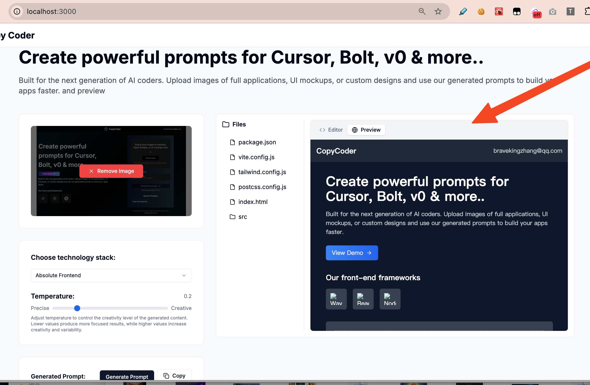

# Super Copy Coder

An AI-powered tool that generates detailed development prompts from UI designs and mockups. Perfect for developers using modern AI coding tools like Cursor, Bolt, and v0.dev.

[](https://vercel.com/new/clone?repository-url=https%3A%2F%2Fgithub.com%2Fbravekingzhang%2Fcopy-coder&env=VISION_API_KEY,CHAT_API_KEY&envDescription=API%20keys%20required%20for%20OpenRouter%20and%20DeepSeek%20API%20access&envLink=https%3A%2F%2Fopenrouter.ai%2Fdocs&demo-title=Super%20Copy%20Coder&demo-description=AI-powered%20prompt%20generator%20for%20developers&demo-url=https%3A%2F%2Fsuper-copy-coder.vercel.app)

[English](./README.md) | [中文](./README_CN.md)

## Preview




### Key Capabilities:

1. **Upload & Analysis**
   - Drag & drop or click to upload UI designs
   - Supports various image formats
   - Real-time visual feedback

2. **Smart Generation**
   - Structured prompt generation
   - Temperature control for creativity adjustment
   - Real-time streaming output with Markdown formatting

3. **Quick Integration**
   - Direct access to Bolt, v0.dev, and Cursor
   - One-click copy functionality
   - Seamless workflow integration

## Features

- **Image Analysis**: Upload UI designs, mockups, or application screenshots
- **Smart Prompt Generation**: Generates detailed, structured prompts optimized for AI coding tools
- **Multiple Application Types**: Support for web, mobile, and desktop application analysis
- **Adjustable AI Parameters**: Control the creativity level with temperature adjustment
- **Real-time Streaming**: See the prompt generation in real-time
- **Markdown Support**: Generated prompts are formatted in Markdown for better readability
- **Quick Access Tools**: Direct integration with popular AI development tools
  - Bolt (https://bolt.new)
  - v0.dev
  - Cursor

## Tech Stack

- Next.js 15
- TypeScript
- Tailwind CSS
- OpenRouter (Gemini Vision) / DeepSeek API Integration
- React Markdown with GFM Support
- Lucide Icons
- Xterm.js for Terminal Emulation
- Zustand for State Management
- CodeMirror for Code Editing
- Radix UI Components
- Framer Motion for Animations

## Getting Started

1. Clone the repository:
```bash
git clone https://github.com/yourusername/super-copy-coder.git
cd super-copy-coder
```

2. Install dependencies:
```bash
npm install
```

3. Set up environment variables:
Create a `.env` file in the root directory with:
```env
# Vision Model Configuration
VISION_BASE_URL=https://openrouter.ai/api/v1
VISION_API_KEY=your_openrouter_api_key
VISION_MODEL=google/gemini-2.0-flash-exp:free

# Vision Model Usage Toggle
USE_VISION_MODEL_CODE=false

# Chat Model Configuration
CHAT_BASE_URL=https://api.deepseek.com/v1
CHAT_API_KEY=your_deepseek_api_key
CHAT_MODEL=deepseek-chat
```

4. Run the development server:
```bash
npm run dev
```

Open [http://localhost:3000](http://localhost:3000) to view the application.

## Usage

1. Upload an image of your UI design (drag & drop or click to upload)
2. Select the type of application (web/mobile/desktop)
3. Adjust the temperature setting if needed
4. Click "Generate prompt"
5. Copy the generated prompt
6. Use the quick access buttons to open your preferred AI coding tool

## Contributing

Contributions are welcome! Please feel free to submit a Pull Request.

## Author

LaoMa XiaoZhang (老码小张)
- WeChat Official Account: 老码小张
- Sharing insights on AI Programming, Full-Stack Development, and Productivity Tools

## License

MIT License - feel free to use this project for your own purposes.

## Support

If you find this tool helpful, consider supporting the project to help maintain and improve it.

## Deployment

### Deploy with Docker (Recommended)

1. Clone the repository and navigate to the project directory:
```bash
git clone https://github.com/bravekingzhang/copy-coder.git
cd copy-coder
```

2. Create a `.env` file from the example:
```bash
cp .env.example .env
```

3. Edit the `.env` file and add your API keys:
```env
VISION_API_KEY=your_openrouter_api_key
CHAT_API_KEY=your_deepseek_api_key
```

4. Build and start the application with Docker Compose:
```bash
docker compose up -d
```

The application will be available at http://localhost:3000

To stop the application:
```bash
docker compose down
```

### Deploy on Vercel (Alternative)

The easiest way to deploy your own copy of Super Copy Coder is to use the Vercel Deploy Button above. This will:

1. Clone this repository to your GitHub account
2. Set up a new project on Vercel
3. Prompt you to add the required environment variables
4. Deploy the application automatically

After deployment, you'll need to:
1. Set up your `VISION_API_KEY` and `CHAT_API_KEY` and other environment variables in the Vercel project settings
2. Configure any additional environment variables if needed

### Manual Deployment

You can also deploy the application manually to any platform that supports Next.js applications. Make sure to:
1. Set up the required environment variables
2. Configure the build settings according to your platform
3. Set up any necessary serverless functions support


## Follow My WeChat Official Account

Stay updated with the latest AI development tips and tools:

<div align="center">
  
  <p><strong>WeChat Official Account: LaoMa XiaoZhang</strong></p>
  <p>Scan the QR code to follow and get the latest updates on:</p>
  <ul align="left">
    <li>🤖 AI Programming Tips & Tricks</li>
    <li>💻 Full-Stack Development Insights</li>
    <li>🛠️ Productivity Tools and Workflows</li>
    <li>🚀 Latest Tech Trends and Reviews</li>
  </ul>
</div>